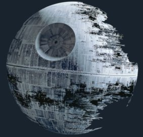

# Tools used for this workshop

This workshop uses Jupyter Notebooks, Napari, Segment Anything (SAM), Cellpose, Stardist and Albumentations among other tools.  In addition the following other projects are used.

[tnia-python](https://github.com/True-North-Intelligent-Algorithms/tnia-python) - This is a general utility project for image processing including deep learning utilities.

[easy-augment-batch-dl](https://github.com/True-North-Intelligent-Algorithms/napari-easy-augment-batch-dl) A plugin to perform deep learning on small to medium sized image sets with UNETs, Cellpose, Stardist, SAM and friends.  In particular this plugin is useful for performing deep learning with a small number of labels and augmentation, and experimenting with different deep learning frameworks.  

[segment-everything](https://github.com/True-North-Intelligent-Algorithms/segment-everything) - This contains utilities for rendering and training prompt-based and overlapping segmentation models (like SAM).  

[napari-segment-everything](https://github.com/True-North-Intelligent-Algorithms/napari-segment-everything) - This is a Napari GUI for segment-everything

## Some examples may be 'under construction' 

   