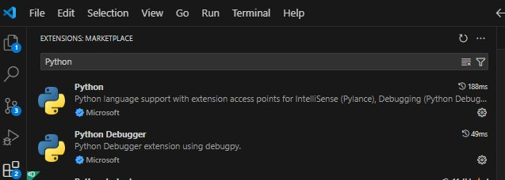
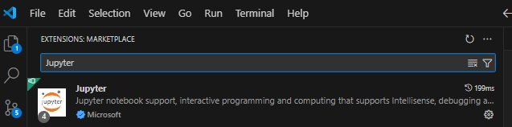

## Setup

Pre-requisites to learn:  No pre-requisites are needed to watch and learn from the examples.  It may be valuable to follow the examples, even if you are not able to run the code.  While these examples are done using 'Jupyter notebooks' the concepts should be relevant to any deep learning framework (including GUI based ones) that expose parameters to address scale and sparsity. 

Pre-requisites to run code:  To run the examples you need a python environment, a dependency manager, and a means to run Jupyter notebooks.  A 'conda' flavor and Visual Studio code is recomended 

## Conda

Instructions to install Conda can be found [here](https://docs.conda.io/projects/conda/en/latest/user-guide/install/index.html)

## Visual Studio Code 

Visual Studio Code can be installed from [here](https://code.visualstudio.com/download)

### Visual Studio Code extensions

The following extensions are needed (you can search for them in the ```Extensions``` panel)

Python Extensions (choose the one from Microsoft)
Python Debugger ()



### Jupyter 

Install the Jupyter extension to run notebooks.

