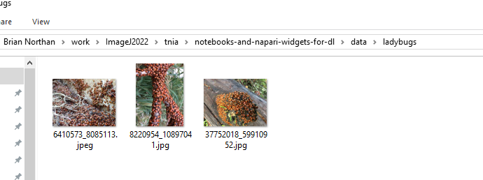
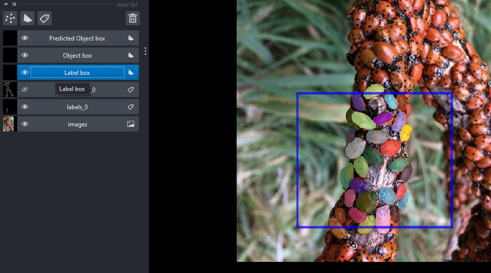
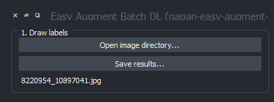

# Load and Label Workflow with Napari-Easy-Augment-Batch-DL

Here we describe how to call ```Napari-Easy-Augment-Batch-DL``` from a notebook, create a label box, then create labels. 

## Preparation

Prior to running notebook ```10_label_predict.ipynb```, put the images you want to work with in a project directory as shown below.  



## Drawing Labels

After running ```10_label_predict.ipynb``` do the following

1️⃣ Select **Label box** layer and draw a label box that is as large or larger than the desired patch size.  
2️⃣ Select **labels** layer and Label objects within the label box.

Then Napari should look as below....




## Save Results

Select ```Save Results``` periodically to save the labels you have drawn.  

  

After saving results folders should be generated for different types of deep learning artifacts.  


Inspect the labels directory to verify labels you have drawn have been saved.  


