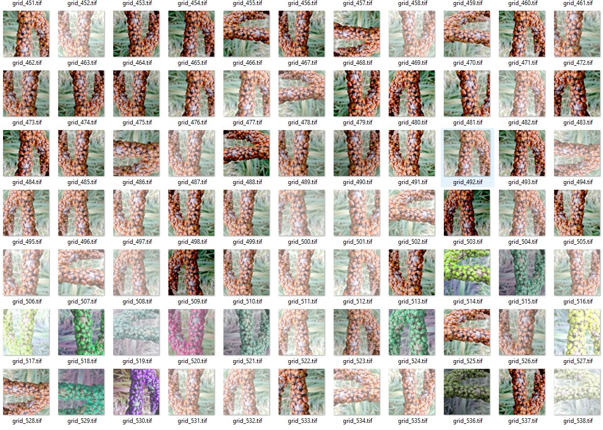

## Augmentation

From a single label we can generate hundred of augmented patches.   Augmentation is often done 'on the fly' during the training process.  However it can be useful to generate the patches before hand to inspect and trouble shoot.  

