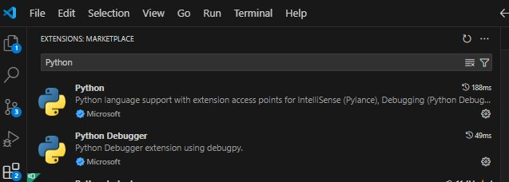

## Setup

#### Pre-requisites to learn  

No pre-requisites are needed to watch and learn from the examples.  It may be valuable to follow the examples, even if you are not able to run the code.  While these examples are done using 'Jupyter notebooks' the concepts should be relevant to any deep learning framework (including GUI based ones) that expose parameters to address scale and sparsity. 

#### Pre-requisites to run code

To run the examples you need a python environment, a dependency manager, and a means to run Jupyter notebooks.  A 'conda' flavor and Visual Studio code is recomended 

## Conda

Instructions to install Conda can be found [here](https://docs.conda.io/projects/conda/en/latest/user-guide/install/index.html)

## Pixi

Pixi is a modern alternative to Conda that's faster and more reliable. For installation instructions, see the [official Pixi installation guide](https://pixi.sh/latest/). 

For more information about using Pixi in this course, see our [Pixi guide](../2025_updates_and_advances/02_Pixi.md).

## Visual Studio Code 

Visual Studio Code can be installed from [here](https://code.visualstudio.com/download)

### Visual Studio Code extensions

The following extensions are needed (you can search for them in the ```Extensions``` panel)

Python Extension and Python Debugger (choose the one from Microsoft)



### Jupyter 

Install the Jupyter extension to run notebooks.

